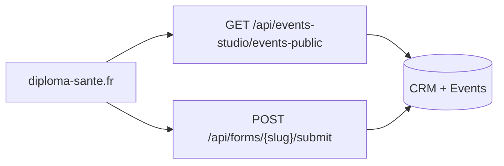

# API Événements — Diploma Santé

Base URL production : `https://hub.diploma-sante.fr`  
Site vitrine : `https://diploma-sante.fr`

Doc destinée à l’équipe **diploma-sante.fr**.  
Scope : **marque Diploma Santé uniquement**.

Le CRM est la source de vérité : dès qu’un événement est **publié** dans Marketing → Événements, il apparaît sur le site. Aucun hardcode de dates / slugs côté WordPress.

---

## Principe

Deux appels suffisent :

1. **Lister** les événements à venir → `GET /api/events-studio/events-public`
2. **Inscrire** un visiteur → formulaire CRM lié à l’événement (`embed.js` ou `GET /public` + `POST /submit`)



Types exposés :

| `type.id` | Libellé | Lieu |
|---|---|---|
| `jpo` | Journée Portes Ouvertes | Campus (adresse) |
| `salon` | Salon | Adresse du salon |
| `webinaire` | Webinaire | En ligne (`is_online: true`, pas de lien Zoom public) |

Le **lien Zoom** n’est jamais renvoyé : il part par email / SMS après inscription.

---

## 1. Lister les événements

### `GET /api/events-studio/events-public`

**Auth :** aucune  
**CORS :** `*`  
**Cache :** 15 s (CDN + navigateur), `stale-while-revalidate` 60 s

| Query | Défaut | Description |
|---|---|---|
| `brand` | `diploma` | Toujours `diploma` pour le site |
| `type` | `jpo,salon,webinaire` | Filtre CSV. Ex. `type=webinaire` ou `type=jpo,salon` |

Filtres appliqués côté CRM :

- marque Diploma
- statut `published`
- date ≥ maintenant (événements passés exclus)
- types JPO / salon / webinaire

```bash
curl 'https://hub.diploma-sante.fr/api/events-studio/events-public?brand=diploma'
```

```bash
curl 'https://hub.diploma-sante.fr/api/events-studio/events-public?brand=diploma&type=webinaire'
```

#### Réponse `200`

```json
{
  "brand": "diploma",
  "events": [
    {
      "id": "uuid",
      "name": "Réforme PASS/LAS",
      "type": { "id": "webinaire", "short": "Webinaire", "label": "Webinaire" },
      "description": "Comprendre la réforme et les voies d’accès.",
      "location": null,
      "is_online": true,
      "event_date": "2026-09-10T19:00:00+02:00",
      "event_time_end": "20:00",
      "date_label": "jeudi 10 septembre 2026",
      "time_label": "19:00 – 20:00",
      "schedule_label": "jeu. 10 sept. 2026 · 19:00–20:00",
      "max_capacity": 80,
      "registered_count": 12,
      "remaining": 68,
      "is_full": false,
      "form_slug": "reforme-pass-las-10-09-2026-ab12",
      "form_url": "https://hub.diploma-sante.fr/forms/reforme-pass-las-10-09-2026-ab12",
      "embed_js_url": "https://hub.diploma-sante.fr/api/forms/reforme-pass-las-10-09-2026-ab12/embed.js",
      "embed_iframe_url": "https://hub.diploma-sante.fr/embed/forms/reforme-pass-las-10-09-2026-ab12"
    }
  ]
}
```

| Champ | Type | Notes |
|---|---|---|
| `id` | uuid | Identifiant événement CRM |
| `name` | string | Titre affiché |
| `type.id` | `jpo` \| `salon` \| `webinaire` | Pour filtrer / icônes |
| `description` | string \| null | Texte public (marqueurs internes déjà retirés) |
| `location` | string \| null | `null` si webinaire |
| `is_online` | boolean | `true` pour les webinaires |
| `event_date` | ISO 8601 | Début, timezone Europe/Paris |
| `event_time_end` | `"HH:mm"` \| null | Heure de fin |
| `date_label` / `time_label` / `schedule_label` | string | Libellés FR déjà formatés |
| `max_capacity` | number \| null | `null` = capacité non limitée |
| `remaining` | number \| null | Places restantes |
| `is_full` | boolean | Masquer le CTA si `true` |
| `form_slug` | string \| null | Slug du formulaire d’inscription |
| `form_url` | string \| null | Page autonome du form |
| `embed_js_url` | string \| null | Script d’embed (recommandé) |
| `embed_iframe_url` | string \| null | iframe |

Si `form_url` / `form_slug` est `null` : ne pas afficher de bouton d’inscription.

#### Erreurs

| Status | Cause |
|---|---|
| `400` | `type` invalide |
| `500` | Erreur interne |

---

### Variante salons uniquement

Déjà utilisée par le hub d’inscription :

```
GET https://hub.diploma-sante.fr/api/events-studio/salons-public?brand=diploma
```

Réponse : `{ "brand": "diploma", "salons": [ ... ] }` — mêmes infos de capacité + `form_url`, **sans** JPO ni webinaires.

Page prête à l’emploi (lien ou iframe) :

```
https://hub.diploma-sante.fr/inscription-salons
```

Pour la page Événements du site, préférer **`events-public`**.

---

## 2. Inscription (formulaire CRM)

Chaque événement a **un formulaire publié** créé automatiquement (6 champs type).  
Même API que les autres forms Diploma.

### Option A — Embed JS (recommandé WordPress / Divi)

Pour chaque événement de la liste, si `!is_full && embed_js_url` :

```html
<div data-diploma-form="FORM_SLUG"></div>
<script async src="https://hub.diploma-sante.fr/api/forms/FORM_SLUG/embed.js"></script>
```

`FORM_SLUG` = `event.form_slug`.

### Option B — Lien / iframe

- Page : `event.form_url`
- iframe : `event.embed_iframe_url`

```html
<iframe
  src="https://hub.diploma-sante.fr/embed/forms/FORM_SLUG"
  width="100%"
  height="640"
  frameborder="0"
  style="border:0;max-width:100%;"
></iframe>
```

### Option C — UI custom React / WP

1. Schéma : `GET /api/forms/{slug}/public`
2. Soumission : `POST /api/forms/{slug}/submit`

#### `GET /api/forms/{slug}/public`

**CORS :** `*`

En plus du schéma de champs, la réponse inclut `event_capacity` si le form est lié à un événement :

```json
{
  "slug": "reforme-pass-las-10-09-2026-ab12",
  "title": "Réforme PASS/LAS — 10/09/2026",
  "submit_label": "Envoyer",
  "fields": [ ],
  "event_capacity": {
    "is_full": false,
    "remaining": 68,
    "max_capacity": 80,
    "registered_count": 12
  }
}
```

Champs type événement :

| `field_key` | Type | Obligatoire |
|---|---|---|
| `firstname` | text | oui |
| `lastname` | text | oui |
| `phone` | phone | non |
| `email` | email | oui |
| `classe_actuelle` | select | oui |
| `departement` | text | oui |

Valeurs `classe_actuelle` (envoyer le **value**, pas le label) :

`seconde` · `premiere` · `terminale` · `bac-obtenu` · `pass-las` · `etudiant-en-sante` · `reorientation` · `autre`

#### `POST /api/forms/{slug}/submit`

**CORS :** `*` · **Content-Type :** `application/json`  
**Origin recommandé :** `https://diploma-sante.fr`

```bash
curl -X POST 'https://hub.diploma-sante.fr/api/forms/FORM_SLUG/submit' \
  -H 'Content-Type: application/json' \
  -H 'Origin: https://diploma-sante.fr' \
  -d '{
    "data": {
      "firstname": "Camille",
      "lastname": "Dupont",
      "email": "camille.dupont@email.fr",
      "phone": "0612345679",
      "classe_actuelle": "terminale",
      "departement": "75"
    },
    "source_url": "https://diploma-sante.fr/evenements/",
    "utm_source": "site",
    "utm_medium": "events"
  }'
```

Réponse `200` :

```json
{
  "ok": true,
  "submission_id": "uuid",
  "redirect_url": null,
  "success_message": "Merci !"
}
```

| Status | Message | Action site |
|---|---|---|
| `200` | `{ "ok": true }` | Succès (ou spam honeypot silencieux) |
| `400` | Champs obligatoires manquants | Afficher l’erreur |
| `403` | Origine / bot | Vérifier `Origin: diploma-sante.fr` |
| `404` | Form introuvable / non publié | Retirer le CTA |
| `409` | `Plus de places disponibles pour cet événement.` | Afficher « Complet » |
| `429` | Trop de soumissions | Rate limit 5/min · 25/h par IP / form |

Garde-fous : origines autorisées `diploma-sante.fr` (+ sous-domaines). Honeypot `hp` si présent doit rester vide.

---

## 3. Intégration type page Événements

```js
const BASE = 'https://hub.diploma-sante.fr'

const { events } = await fetch(
  `${BASE}/api/events-studio/events-public?brand=diploma`
).then((r) => r.json())

// Cartes
events.forEach((ev) => {
  // titre : ev.name
  // date  : ev.date_label + ' · ' + ev.time_label
  // lieu  : ev.is_online ? 'En ligne' : ev.location
  // CTA   : ev.is_full || !ev.form_slug ? 'Complet' : 'S’inscrire'
})
```

CTA recommandé :

- **Webinaire / JPO** : embed du form dans une modale, ou lien `form_url`
- **Salon** : idem, ou rediriger vers `https://hub.diploma-sante.fr/inscription-salons` si vous voulez le choix de lieu + places restantes déjà UI

Ne **pas** cacher un événement complet : l’afficher avec badge « Complet » (sauf si vous préférez le filtrer avec `events.filter(e => !e.is_full)`).

---

## 4. Tracking (optionnel)

Même tracker que le reste du site :

```html
<script>
  window.DIPLOMA_TRACK = {
    endpoint: "https://hub.diploma-sante.fr/api/web/track",
    site: "diploma-sante.fr"
  };
</script>
<script defer src="https://hub.diploma-sante.fr/diploma-tracker.js"></script>
```

Passer `source_url` + UTM au `POST /submit` pour l’attribution CRM.

---

## 5. Hors scope (ne pas utiliser depuis le site)

| Endpoint | Raison |
|---|---|
| `/api/events-studio/events` | Admin CRM (auth session) |
| `/api/events-studio/planning` | Admin planning staff |
| `/api/events-studio/planning-public` | Inscription **staff interne**, pas visiteurs |
| `/api/external/forms` | Clé API plateforme Events (serveur à serveur) |

---

## Checklist équipe site

1. Appeler `GET /api/events-studio/events-public?brand=diploma` (client ou serveur)
2. Afficher JPO / salons / webinaires (filtre `type` si pages séparées)
3. CTA inscription via `embed.js` **ou** `form_url` **ou** `/public` + `/submit`
4. Gérer `is_full` / HTTP `409`
5. Tester depuis `Origin: https://diploma-sante.fr`
6. Ne jamais afficher ni demander le lien Zoom

Contact technique CRM : hub `https://hub.diploma-sante.fr` — Marketing → Événements.
