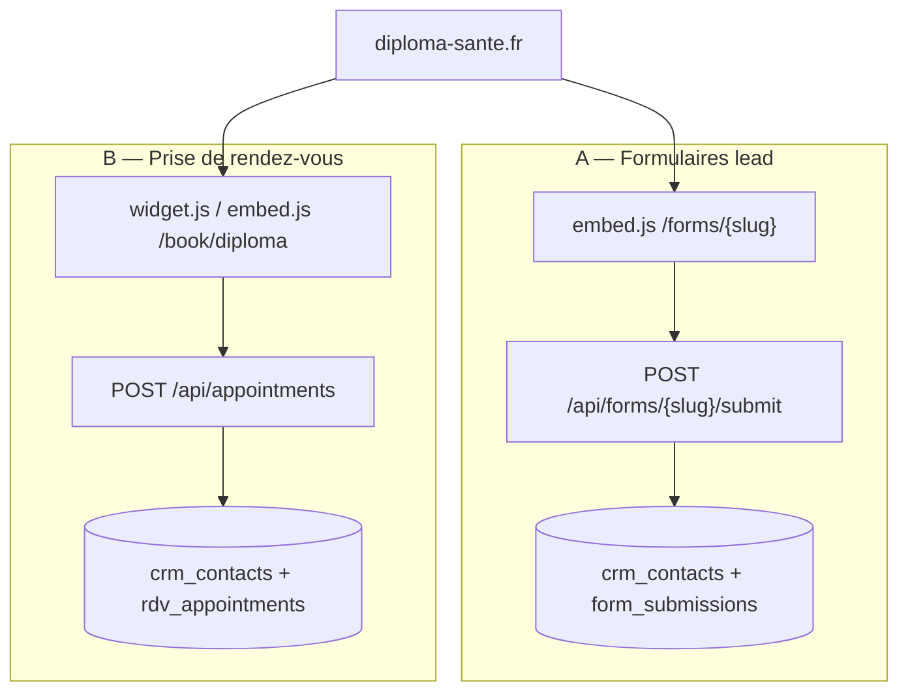

# API Formulaires — Diploma Santé

Base URL production : `https://hub.diploma-sante.fr`  
Site vitrine : `https://diploma-sante.fr`

Doc destinée à l’intégration du **nouveau site diploma-sante.fr**.  
Scope : **marque Diploma Santé uniquement** (folder CRM `Diploma Santé`).

---

## Deux familles de formulaires

Sur Diploma Santé, il y a **deux systèmes distincts**. Ne pas les mélanger.

Doc **événements** (JPO / salons / webinaires) : [`api-events-diploma-sante.md`](./api-events-diploma-sante.md).

| Famille | Rôle | Système | Endpoint principal |
|---|---|---|---|
| **A. Formulaires lead** | Capturer un prospect (candidature, brochure, guide…) | Builder CRM `/api/forms/{slug}` | `POST /api/forms/{slug}/submit` |
| **B. Prise de RDV** | Réserver un créneau d’info (calendrier + form) | Widget booking dédié | `POST /api/appointments` |
| **C. Événements** | Lister JPO / salons / webinaires + inscription | Events CRM | `GET /api/events-studio/events-public` |



**Pourquoi deux systèmes ?**  
Les forms lead sont dynamiques (champs configurés dans le CRM, un slug par form).  
La prise de RDV a un parcours calendrier + créneaux + confirmation SMS/email — elle n’utilise **pas** `/api/forms`.

---

## A. Formulaires lead (CRM)

### A.1 Types de formulaires (usage métier)

Tous passent par la **même API** (`/api/forms/{slug}/…`).  
Le « type » = le **slug** publié dans le CRM (folder `Diploma Santé`, status `published`).

| Type | Usage typique sur le site | Comportement post-submit |
|---|---|---|
| **Candidature** | Page candidature / PASS-LAS / prépa | Redirect conditionnel selon la classe (voir A.6) |
| **Brochure** | Téléchargement brochure | PDF via `redirect_url` — **pas** de redirect conditionnel classe |
| **Guide Parcoursup** | Lead magnet guide | PDF via `redirect_url` |
| **Kit PASS / LAS** | Lead magnet kit | PDF via `redirect_url` |
| **Infos / Financement / Events** | Landing, CTA, soirée PO | Selon config du form |

Pattern d’embed (à coller tel quel, en changeant le slug) :

```html
<div data-diploma-form="SLUG"></div>
<script async src="https://hub.diploma-sante.fr/api/forms/SLUG/embed.js"></script>
```

Également disponibles pour chaque slug :

- Page : `https://hub.diploma-sante.fr/forms/{slug}`
- iframe : `https://hub.diploma-sante.fr/embed/forms/{slug}`
- Schéma : `GET /api/forms/{slug}/public`
- Submit : `POST /api/forms/{slug}/submit`

---

### A.1bis Codes d’intégration — tous les forms Diploma publiés

Slugs issus du CRM production (folder `Diploma Santé`, status `published`).  
Copier-coller directement sur diploma-sante.fr.

#### Lead magnets (PDF après submit)

**Brochure Diploma Santé** → `https://hub.diploma-sante.fr/brochures/ds-brochure-2026.pdf`

```html
<div data-diploma-form="ns-brochure-diploma-sante-hs61dd5d"></div>
<script async src="https://hub.diploma-sante.fr/api/forms/ns-brochure-diploma-sante-hs61dd5d/embed.js"></script>
```

**Guide Parcoursup 2026** → `https://hub.diploma-sante.fr/brochures/guide-parcoursup.pdf`

```html
<div data-diploma-form="ns-formulaire-guide-parcoursup-2026-dipl-hscd8dd6"></div>
<script async src="https://hub.diploma-sante.fr/api/forms/ns-formulaire-guide-parcoursup-2026-dipl-hscd8dd6/embed.js"></script>
```

**Kit PASS / LAS** → `https://hub.diploma-sante.fr/brochures/fiches-cours-pass-las.pdf`

```html
<div data-diploma-form="ns-formulaire-kit-pass-las-hs321c61"></div>
<script async src="https://hub.diploma-sante.fr/api/forms/ns-formulaire-kit-pass-las-hs321c61/embed.js"></script>
```

#### Candidatures (redirect conditionnel Terminale / non-Terminale)

**Candidater Global**

```html
<div data-diploma-form="ns-candidater-global-hs1fd83d"></div>
<script async src="https://hub.diploma-sante.fr/api/forms/ns-candidater-global-hs1fd83d/embed.js"></script>
```

**Candidater Header**

```html
<div data-diploma-form="ns-candidater-header-hs70cd44"></div>
<script async src="https://hub.diploma-sante.fr/api/forms/ns-candidater-header-hs70cd44/embed.js"></script>
```

**Candidater Article**

```html
<div data-diploma-form="ns-candidater-article-hs4ee975"></div>
<script async src="https://hub.diploma-sante.fr/api/forms/ns-candidater-article-hs4ee975/embed.js"></script>
```

**Candidater Prépa PASS**

```html
<div data-diploma-form="ns-candidater-prepa-pass-hs350993"></div>
<script async src="https://hub.diploma-sante.fr/api/forms/ns-candidater-prepa-pass-hs350993/embed.js"></script>
```

**Candidater Prépa LAS**

```html
<div data-diploma-form="ns-candidater-prepa-las-hs4633f0"></div>
<script async src="https://hub.diploma-sante.fr/api/forms/ns-candidater-prepa-las-hs4633f0/embed.js"></script>
```

**Candidater Prépa LSPS**

```html
<div data-diploma-form="ns-candidater-prepa-lsps-hs2d5675"></div>
<script async src="https://hub.diploma-sante.fr/api/forms/ns-candidater-prepa-lsps-hs2d5675/embed.js"></script>
```

**Candidater Terminale Santé**

```html
<div data-diploma-form="ns-candidater-terminale-sante-hsca3e0b"></div>
<script async src="https://hub.diploma-sante.fr/api/forms/ns-candidater-terminale-sante-hsca3e0b/embed.js"></script>
```

**Candidater Première Élite**

```html
<div data-diploma-form="ns-candidater-premiere-elite-hs9d47bb"></div>
<script async src="https://hub.diploma-sante.fr/api/forms/ns-candidater-premiere-elite-hs9d47bb/embed.js"></script>
```

**Candidater PAES**

```html
<div data-diploma-form="ns-candidater-paes-hsac0864"></div>
<script async src="https://hub.diploma-sante.fr/api/forms/ns-candidater-paes-hsac0864/embed.js"></script>
```

**Candidater Paris 16**

```html
<div data-diploma-form="ns-candidater-paris-16-hsae66bc"></div>
<script async src="https://hub.diploma-sante.fr/api/forms/ns-candidater-paris-16-hsae66bc/embed.js"></script>
```

#### Infos / Financement / Events

**Obtenir plus d’informations**

```html
<div data-diploma-form="ns-obtenir-plus-d-informations-hs904f68"></div>
<script async src="https://hub.diploma-sante.fr/api/forms/ns-obtenir-plus-d-informations-hs904f68/embed.js"></script>
```

**Financement**

```html
<div data-diploma-form="ns-financement-hsa8e997"></div>
<script async src="https://hub.diploma-sante.fr/api/forms/ns-financement-hsa8e997/embed.js"></script>
```

**FORM COMPLÉMENT**

```html
<div data-diploma-form="form-complement-kzjx"></div>
<script async src="https://hub.diploma-sante.fr/api/forms/form-complement-kzjx/embed.js"></script>
```

**Soirée portes ouvertes — 16/07**

```html
<div data-diploma-form="form-soiree-portes-ouvertes-16-07-9ih7"></div>
<script async src="https://hub.diploma-sante.fr/api/forms/form-soiree-portes-ouvertes-16-07-9ih7/embed.js"></script>
```

#### Récap slugs

| Formulaire | Slug |
|---|---|
| Brochure | `ns-brochure-diploma-sante-hs61dd5d` |
| Guide Parcoursup 2026 | `ns-formulaire-guide-parcoursup-2026-dipl-hscd8dd6` |
| Kit PASS / LAS | `ns-formulaire-kit-pass-las-hs321c61` |
| Candidater Global | `ns-candidater-global-hs1fd83d` |
| Candidater Header | `ns-candidater-header-hs70cd44` |
| Candidater Article | `ns-candidater-article-hs4ee975` |
| Candidater Prépa PASS | `ns-candidater-prepa-pass-hs350993` |
| Candidater Prépa LAS | `ns-candidater-prepa-las-hs4633f0` |
| Candidater Prépa LSPS | `ns-candidater-prepa-lsps-hs2d5675` |
| Candidater Terminale Santé | `ns-candidater-terminale-sante-hsca3e0b` |
| Candidater Première Élite | `ns-candidater-premiere-elite-hs9d47bb` |
| Candidater PAES | `ns-candidater-paes-hsac0864` |
| Candidater Paris 16 | `ns-candidater-paris-16-hsae66bc` |
| Obtenir plus d’infos | `ns-obtenir-plus-d-informations-hs904f68` |
| Financement | `ns-financement-hsa8e997` |
| FORM COMPLÉMENT | `form-complement-kzjx` |
| Soirée PO 16/07 | `form-soiree-portes-ouvertes-16-07-9ih7` |

### A.2 Endpoints lead

| Endpoint | Méthode | Auth | Usage |
|---|---|---|---|
| `/api/forms/{slug}/public` | `GET` | Aucune | Schéma (custom UI React) |
| `/api/forms/{slug}/embed.js` | `GET` | Aucune | Embed autonome one-liner |
| `/api/forms/{slug}/submit` | `POST` | Aucune (+ garde-fous) | Soumission |
| `/api/forms/prefill` | `GET` | Token HMAC `t` | Pré-remplissage (emails / liens perso) |
| `/api/web/track` | `POST` | Optionnel | Tracking pages / attribution |
| `/api/external/forms` | `GET` | Clé API | Liste des forms |
| `/api/external/forms` | `POST` | Clé API | Créer un form (Events platform) |

Pages front :

- Plein écran : `https://hub.diploma-sante.fr/forms/{slug}`
- iframe : `https://hub.diploma-sante.fr/embed/forms/{slug}`
- Lien pré-rempli : `https://hub.diploma-sante.fr/forms/{slug}?t={token}`

---

### A.3 Schéma public

#### `GET /api/forms/{slug}/public`

**CORS :** `*` · **Cache :** `max-age=10, s-maxage=10, stale-while-revalidate=60`

```json
{
  "id": "uuid",
  "slug": "ns-candidater-prepa-pass-hs350993",
  "title": "NS - Candidater Prépa PASS",
  "subtitle": null,
  "submit_label": "Envoyer",
  "success_message": "Merci !",
  "redirect_url": null,
  "redirect_file_url": null,
  "primary_color": "#...",
  "bg_color": "#...",
  "text_color": "#...",
  "honeypot_enabled": true,
  "fields": [
    {
      "field_type": "email",
      "field_key": "email",
      "label": "Email",
      "placeholder": null,
      "help_text": null,
      "default_value": null,
      "required": true,
      "options": [],
      "validation": {}
    }
  ]
}
```

| Status | Body |
|---|---|
| `404` | `{ "error": "Form not found" }` |

> Side effect : incrément `view_count` (best-effort).

**Types de champs possibles :**  
`text` · `textarea` · `email` · `phone` · `select` · `radio` · `checkbox` · `date` · `number` · `hidden`

---

### A.4 Embed JavaScript (recommandé WordPress / Divi)

#### `GET /api/forms/{slug}/embed.js`

```html
<div data-diploma-form="ns-candidater-prepa-pass-hs350993"></div>
<script
  async
  src="https://hub.diploma-sante.fr/api/forms/ns-candidater-prepa-pass-hs350993/embed.js"
></script>
```

1. Monte le form dans le container (schéma inliné)
2. Soumet vers `POST /api/forms/{slug}/submit`
3. Applique `redirect_url` / message de succès

Si aucun `div[data-diploma-form]` n’existe, le script en crée un avant la balise `<script>`.

| Status | Body |
|---|---|
| `404` | `// Form not found or not published` |

---

### A.5 Soumission

#### `POST /api/forms/{slug}/submit`

**CORS :** `*` · **Préflight :** `OPTIONS` → `204`

| Header | Obligatoire | Description |
|---|---|---|
| `Content-Type` | Oui | `application/json` |
| `Origin` / `Referer` | Recommandé | Domaine autorisé (sauf bypass) |
| `x-form-submit-bypass` | Non | Secret de test (`FORM_SUBMIT_BYPASS_SECRET`) |

#### Body

```ts
{
  data: Record<string, unknown>  // field_key → valeur (obligatoire)
  hp?: string                    // honeypot : vide / absent
  contact_token?: string         // token préfill (?t=)
  source_url?: string
  utm_source?: string
  utm_medium?: string
  utm_campaign?: string
  utm_term?: string
  utm_content?: string
  attribution?: {
    gclid?: string
    gbraid?: string
    wbraid?: string
    fbclid?: string
    msclkid?: string
    ttclid?: string
    li_fat_id?: string
    sccid?: string
  }
}
```

Exemple :

```bash
curl -X POST 'https://hub.diploma-sante.fr/api/forms/ns-candidater-prepa-pass-hs350993/submit' \
  -H 'Content-Type: application/json' \
  -H 'Origin: https://diploma-sante.fr' \
  -d '{
    "data": {
      "firstname": "Camille",
      "lastname": "Dupont",
      "email": "camille.dupont@email.fr",
      "phone": "0612345679",
      "classe_actuelle": "Terminale",
      "departement": "75"
    },
    "source_url": "https://diploma-sante.fr/candidature/",
    "utm_source": "google",
    "utm_medium": "cpc",
    "utm_campaign": "pass-las-2026",
    "attribution": { "gclid": "Cj0KCQ..." }
  }'
```

#### Réponse `200`

```json
{
  "ok": true,
  "submission_id": "uuid",
  "redirect_url": "https://diploma-sante.fr/remerciement-candidature-formulaire/",
  "success_message": "Merci !"
}
```

Honeypot déclenché → `{ "ok": true }` sans créer de contact (`spam`).

#### Erreurs

| Status | Message typique | Cause |
|---|---|---|
| `400` | Lien personnalisé invalide ou expiré | `contact_token` invalide |
| `400` | Ce lien ne correspond pas à ce formulaire | Token slug ≠ slug URL |
| `400` | Champs obligatoires manquants | Required vides |
| `400` | Email / téléphone / identité / source test invalides | Anti-test |
| `403` | Requête refusée | Bot UA ou origine non autorisée |
| `404` | Formulaire introuvable ou non publié | Slug inconnu / draft |
| `404` | Contact introuvable pour ce lien | `cid` token absent |
| `429` | Trop de soumissions | Rate limit |
| `500` | Erreur enregistrement soumission | Échec DB |

#### Garde-fous

- Rate limit : **5 / min** et **25 / h** par formulaire / IP
- Origines Diploma autorisées : `diploma-sante.fr`, `hub.diploma-sante.fr`, `admission.diploma-sante.fr`, `edumove.fr` (+ sous-domaines)
- Extra : `FORM_SUBMIT_ALLOWED_ORIGINS` (CSV)
- Bypass : header `x-form-submit-bypass` **ou** `contact_token` valide
- Honeypot : si `honeypot_enabled` et `hp` non vide → spam silencieux

#### Side effects

1. Upsert `crm_contacts` (match email puis téléphone ; IDs `NATIVE_*` pour les nouveaux)
2. `origine` :
   - `Campagne ADS Google` si `gclid` / `gbraid` / `wbraid`
   - `Campagne ADS META` si `fbclid`
   - sinon `Formulaire web`
3. Click IDs + UTM → `hubspot_raw`
4. Insert `form_submissions` (`status: new`)
5. Workflows CRM `form_submitted`
6. Notification Brevo (`form.notify_emails`)
7. Webhook sortant éventuel (plateforme events)

> **Pas d’écriture HubSpot** à la soumission. Le CRM Supabase est la source de vérité.

---

### A.6 Redirects conditionnels (folder Diploma Santé)

Pour les forms **éligibles** (candidatures — pas brochure / guide / kit) :

| `classe_actuelle` | URL de remerciement |
|---|---|
| Contient `terminale` | `https://diploma-sante.fr/remerciement-candidature-formulaire/` |
| Autre | `https://diploma-sante.fr/remerciement-candidature/` |

Sinon : `redirect_file_url` puis `redirect_url` configurés sur le form.

---

### A.7 Pré-remplissage (campagnes email)

#### Token HMAC

Format : `{payload_b64url}.{signature_hmac_sha256_b64url}`

```ts
{
  cid: string          // hubspot_contact_id CRM (obligatoire)
  slug?: string
  exp?: number         // Unix ms (défaut +90 jours)
  firstname?: string
  lastname?: string
  email?: string
  phone?: string
}
```

Secret : `FORM_CONTACT_LINK_SECRET`

Lien public :

```
https://hub.diploma-sante.fr/forms/{slug}?t={token}
```

#### `GET /api/forms/prefill?t={token}&slug={slug?}`

```json
{
  "ok": true,
  "hubspot_contact_id": "NATIVE_...",
  "brand_slug": "ns-candidater-prepa-pass-hs350993",
  "values": {
    "firstname": "Camille",
    "lastname": "Dupont",
    "email": "camille.dupont@email.fr",
    "phone": "0612345679",
    "departement": "75",
    "classe_actuelle": "Terminale"
  },
  "hidden_field_keys": ["firstname", "lastname", "email", "phone"],
  "greeting": "Camille"
}
```

À la soumission, renvoyer le token :

```json
{
  "data": { "classe_actuelle": "Terminale", "departement": "75" },
  "contact_token": "eyJ...token..."
}
```

Effets : lie au contact `cid`, injecte l’identité manquante, bypass bot/origine.

---

### A.8 Mapping champs CRM

| Clés acceptées dans `data` | Colonne CRM |
|---|---|
| `firstname`, `prenom` | `firstname` |
| `lastname`, `nom` | `lastname` |
| `email` | `email` |
| `phone`, `mobilephone` | `phone` |
| `classe_actuelle`, `classe` | `classe_actuelle` |
| `departement`, `department` | `departement` |
| `zone_localite`, `zone` | `zone_localite` |
| `formation_souhaitee`, `formation` | `formation_souhaitee` |
| `formation_demandee`, `diploma_sante___formation_demandee` | `formation_demandee` |

Champs custom non mappés → stockés dans `hubspot_raw`.

Les champs **obligatoires** sont ceux avec `required: true` dans le schéma du form (pas une liste fixe globale).  
Nouveau form CRM par défaut : `firstname`, `lastname`, `email` requis · `phone` optionnel.

---

### A.9 Tracking web

#### `POST /api/web/track`

Auth optionnelle : `X-Tracking-Token: WEB_TRACKING_TOKEN`

```ts
{
  event_name: string           // obligatoire
  occurred_at?: string
  page_url?: string
  page_title?: string
  referrer?: string
  utm_source?: string
  utm_medium?: string
  utm_campaign?: string
  session_id?: string
  event_id?: string
  site?: string                // ex. "diploma-sante.fr"
  contact?: {
    hubspot_contact_id?: string
    email?: string
    phone?: string
  }
  metadata?: Record<string, unknown>
}
```

Contact non résolu → `{ "ok": true, "ignored": true, "reason": "contact_not_resolved" }`

#### Script client

```html
<script>
  window.DiplomaTrackerConfig = {
    endpoint: "https://hub.diploma-sante.fr/api/web/track",
    token: "OPTIONAL_WEB_TRACKING_TOKEN",
    site: "diploma-sante.fr",
    contact: { email: "..." }
  };
</script>
<script defer src="https://hub.diploma-sante.fr/diploma-tracker.js"></script>
```

Cookies first-touch `_dpa_{clickId}` (90 jours) pour `gclid`, `fbclid`, etc. — réutilisés à la soumission form.

---

### A.10 Liste des forms (interne / plateforme)

#### `GET /api/external/forms`

Auth : `Authorization: Bearer <EVENT_PLATFORM_API_KEY>` ou `X-API-Key`

```json
[
  { "id": "uuid", "slug": "ns-candidater-prepa-pass-hs350993", "name": "NS - Candidater Prépa PASS", "status": "published" }
]
```

---

## B. Prise de rendez-vous

Système **indépendant** des formulaires lead.  
Aucun conflit de CSS / sélecteurs / namespace avec `data-diploma-form`.

### B.1 Surfaces disponibles

| Surface | URL / script | Usage |
|---|---|---|
| Page autonome | `https://hub.diploma-sante.fr/book/diploma` | Lien envoyé par télépros / landing dédiée |
| Embed iframe | `https://hub.diploma-sante.fr/embed/rdv` | iframe manuelle |
| Embed inline | `/api/booking/embed.js` + `data-diploma-rdv-inline` | Bloc dans une page (auto-resize) |
| Embed popup Divi | `/api/booking/embed.js` + `data-diploma-rdv-popup` | Modal Divi (hauteur fixe) |
| Widget bouton | `/api/booking/widget.js` + `data-diploma-rdv` | Bouton → popup type Calendly |

Événement : **Rendez-vous d’information — Diploma Santé**  
Durée : **30 min** · Créneaux : **9h–22h** · Réservation à partir de **demain**.

### B.2 Intégrations HTML (site diploma-sante.fr)

#### Bouton popup (recommandé CTA)

```html
<button data-diploma-rdv>Prendre rendez-vous</button>
<script async src="https://hub.diploma-sante.fr/api/booking/widget.js"></script>
```

API JS optionnelle :

```js
window.DiplomaRdv.open()
window.DiplomaRdv.close()
```

#### Inline (section pleine largeur)

```html
<div data-diploma-rdv-inline></div>
<script async src="https://hub.diploma-sante.fr/api/booking/embed.js"></script>
```

L’iframe envoie `postMessage({ type: 'diploma-rdv-resize', height })` pour s’adapter à la hauteur.

#### Popup Divi / modal (hauteur fixe)

```html
<div data-diploma-rdv-popup data-height="680px"></div>
<script async src="https://hub.diploma-sante.fr/api/booking/embed.js"></script>
```

> Ne pas mélanger `data-diploma-rdv-inline` et `data-diploma-rdv-popup` sur le même embed.

Les params UTM de la page (`utm_source`, `utm_medium`, `utm_campaign`, `utm_content`, `ref`) sont **recopiés** dans l’iframe automatiquement.

### B.3 Parcours utilisateur

1. **Date** — calendrier (jours disponibles dès J+1)
2. **Créneau** — slots 30 min (9h–22h)
3. **Formulaire** — identité + contexte + lieu
4. **Succès** — confirmation + SMS / email

### B.4 Champs du formulaire RDV

| Champ UI | Clé API | Obligatoire | Valeurs / format |
|---|---|---|---|
| Prénom | `prospect_firstname` | Oui | texte |
| Nom | `prospect_lastname` | Oui | texte |
| Email | `prospect_email` | Oui | email |
| Téléphone | `prospect_phone` | Oui | normalisé `+33…` |
| Département | `departement` | Oui | 2–3 chiffres ou `2A`/`2B` |
| Classe | `classe_actuelle` | Oui | voir liste ci-dessous |
| Formation | `formation_type` | Oui | voir liste ci-dessous |
| Lieu | `meeting_type` | Oui | `presentiel` \| `visio` |
| Créneau début | `start_at` | Oui | ISO datetime |
| Créneau fin | `end_at` | Oui | ISO datetime |

**Classes :**

- `Seconde`
- `Première`
- `Terminale`
- `Bac+1 / Réorientation`
- `Étudiant en médecine (PASS / L.AS)`
- `Parent d’élève`
- `Autre`

**Formations :**

- `Prépa Médecine (PASS / L.AS)`
- `Terminale Santé`
- `Première Santé`
- `Stage de pré-rentrée`
- `Accompagnement Parcoursup`
- `Je ne sais pas encore`

Présentiel → adresse affichée : **100 quai de la Rapée 75012 Paris**  
Visio → lien Google Meet généré automatiquement.

### B.5 API de création de RDV

#### `POST /api/appointments`

Utilisé par le widget public (`web_booking: true`, `source: "prospect"`).

```bash
curl -X POST 'https://hub.diploma-sante.fr/api/appointments' \
  -H 'Content-Type: application/json' \
  -H 'Origin: https://diploma-sante.fr' \
  -d '{
    "web_booking": true,
    "source": "prospect",
    "prospect_name": "Camille Dupont",
    "prospect_firstname": "Camille",
    "prospect_lastname": "Dupont",
    "prospect_email": "camille.dupont@email.fr",
    "prospect_phone": "+33612345679",
    "start_at": "2026-08-15T10:00:00.000Z",
    "end_at": "2026-08-15T10:30:00.000Z",
    "formation_type": "Prépa Médecine (PASS / L.AS)",
    "meeting_type": "visio",
    "departement": "75",
    "classe_actuelle": "Terminale",
    "call_notes": "Lieu : Visioconférence — [Tracking: source=google | medium=cpc]"
  }'
```

#### Body (web booking)

```ts
{
  web_booking: true                 // obligatoire pour le flux site
  source: "prospect"                // obligatoire pour le flux site
  prospect_name: string             // "Prénom Nom" (requis)
  prospect_firstname?: string
  prospect_lastname?: string
  prospect_email: string            // requis
  prospect_phone?: string
  start_at: string                  // ISO, requis
  end_at: string                    // ISO, requis
  formation_type?: string
  meeting_type?: "presentiel" | "visio" | "telephone"
  departement?: string
  classe_actuelle?: string
  call_notes?: string               // tracking UTM + lieu
}
```

Champs requis API : `prospect_name`, `prospect_email`, `start_at`, `end_at`.  
Le widget impose en plus téléphone, département, classe, formation, lieu.

#### Réponse succès

```json
{ "ok": true, "id": "uuid", /* …appointment */ }
```

| Status | Cause |
|---|---|
| `400` | Champs requis manquants |
| `500` | Erreur création |

#### Side effects (web booking)

1. Upsert `crm_contacts` par email  
   - Nouveau → `origine: "Prise de RDV - Site web"`, ID `NATIVE_*`
2. Auto-assignation closer (règle métier en vigueur)
3. Insert `rdv_appointments`
4. Si `visio` → génération Google Meet
5. SMS + email de confirmation au prospect
6. Deal CRM « RDV pris » + activité timeline

---

## Exemples d’intégration site

### Lead — embed one-liner

```html
<div data-diploma-form="ns-candidater-prepa-pass-hs350993"></div>
<script async src="https://hub.diploma-sante.fr/api/forms/ns-candidater-prepa-pass-hs350993/embed.js"></script>
```

> Tous les codes prêts à coller : section **A.1bis**.

### Lead — custom UI (React / Next)

```js
const slug = 'ns-candidater-prepa-pass-hs350993'
const schema = await fetch(
  `https://hub.diploma-sante.fr/api/forms/${slug}/public`
).then(r => r.json())

const res = await fetch(
  `https://hub.diploma-sante.fr/api/forms/${slug}/submit`,
  {
    method: 'POST',
    headers: { 'Content-Type': 'application/json' },
    body: JSON.stringify({
      data: Object.fromEntries(new FormData(formEl)),
      source_url: location.href,
      utm_source: new URLSearchParams(location.search).get('utm_source'),
      attribution: window.DiplomaTracker?.getAttribution?.() || {},
    }),
  }
)
const json = await res.json()
if (json.redirect_url) location.href = json.redirect_url
```

### RDV — bouton CTA

```html
<button data-diploma-rdv class="btn-cta">Prendre un rendez-vous</button>
<script async src="https://hub.diploma-sante.fr/api/booking/widget.js"></script>
```

### RDV — section inline

```html
<section id="rdv">
  <div data-diploma-rdv-inline></div>
</section>
<script async src="https://hub.diploma-sante.fr/api/booking/embed.js"></script>
```

### Tracking + forms (combo recommandé)

```html
<script>
  window.DiplomaTrackerConfig = {
    endpoint: "https://hub.diploma-sante.fr/api/web/track",
    site: "diploma-sante.fr"
  };
</script>
<script defer src="https://hub.diploma-sante.fr/diploma-tracker.js"></script>

<div data-diploma-form="ns-candidater-prepa-pass-hs350993"></div>
<script async src="https://hub.diploma-sante.fr/api/forms/ns-candidater-prepa-pass-hs350993/embed.js"></script>
```

---

## Variables d’environnement (Diploma)

| Variable | Rôle |
|---|---|
| `FORM_CONTACT_LINK_SECRET` | Signature tokens préfill |
| `FORM_SUBMIT_ALLOWED_ORIGINS` | Hosts supplémentaires (CSV) |
| `FORM_SUBMIT_ALLOW_LOCALHOST` | Autorise localhost en prod si `1` |
| `FORM_SUBMIT_BYPASS_SECRET` | Bypass garde-fous (tests) |
| `EVENT_PLATFORM_API_KEY` | Auth `/api/external/forms` |
| `EVENT_PLATFORM_WEBHOOK_URL` / `_SECRET` | Webhook sortant post-submit |
| `WEB_TRACKING_TOKEN` | Auth optionnelle `/api/web/track` |
| `BREVO_API_KEY` | Notifications email forms |
| `NEXT_PUBLIC_FORM_URL` / `NEXT_PUBLIC_SITE_URL` | Base URL liens préfill |

---

## Hors scope (APIs connexes Diploma, pas des forms site)

| Endpoint | Rôle |
|---|---|
| `POST /api/webhooks/diploma-inscription` | Trigger sync inscriptions `admission.diploma-sante.fr` |
| `GET /api/cron/diploma-sync` | Miroir pré-inscriptions → deals `dpl_*` |
| `POST /api/webhooks/calendly` | Ingress Calendly (canal parallèle, pas le widget site) |
| Admin `/api/forms` CRUD | Builder CRM (privé) |

---

## Checklist intégration nouveau site

1. Identifier les **slugs** Diploma à embarquer (CRM folder `Diploma Santé`, status `published`)
2. Poser le **tracker** `diploma-tracker.js` en global
3. Embarquer chaque **form lead** via `embed.js` ou custom UI + `/public` + `/submit`
4. Embarquer la **prise de RDV** via `widget.js` (CTA) et/ou `embed.js` (section)
5. Vérifier les pages de remerciement (terminale vs non-terminale) côté diploma-sante.fr
6. Tester depuis `Origin: https://diploma-sante.fr` (garde-fous origines)
