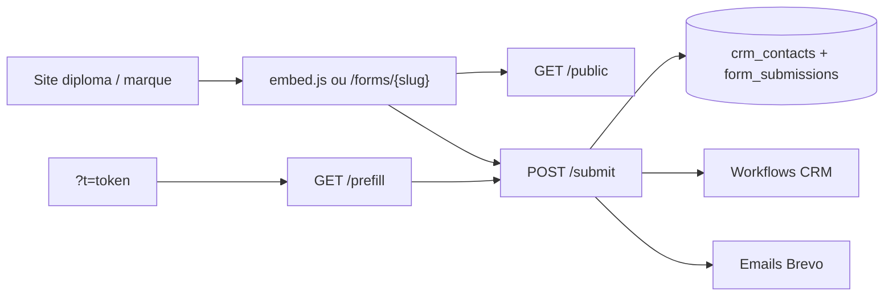

# API Formulaires Diploma Santé

Base URL production : `https://hub.diploma-sante.fr`

Cette doc couvre les APIs **publiques** utilisées pour afficher, pré-remplir et soumettre les formulaires CRM Diploma Santé (sites web, embeds, campagnes email).

Les formulaires ne sont exposés que s’ils ont le statut `published`.

---

## Vue d’ensemble

| Endpoint | Méthode | Auth | Usage |
|---|---|---|---|
| `/api/forms/{slug}/public` | `GET` | Aucune | Schéma du formulaire (renderer / custom UI) |
| `/api/forms/{slug}/embed.js` | `GET` | Aucune | Script d’embed autonome |
| `/api/forms/{slug}/submit` | `POST` | Aucune (+ garde-fous) | Soumission |
| `/api/forms/prefill` | `GET` | Token HMAC `t` | Pré-remplissage contact |
| `/api/web/track` | `POST` | Optionnel | Tracking web / attribution |
| `/api/external/forms` | `GET` | Clé API | Liste des forms (plateforme events) |

Pages front associées :

- Formulaire plein écran : `https://hub.diploma-sante.fr/forms/{slug}`
- Embed iframe : `https://hub.diploma-sante.fr/embed/forms/{slug}`
- Lien pré-rempli : `https://hub.diploma-sante.fr/forms/{slug}?t={token}`



---

## 1. Schéma public

### `GET /api/forms/{slug}/public`

Retourne le schéma d’un formulaire publié (champs, styles, messages).

**Auth :** aucune  
**CORS :** `Access-Control-Allow-Origin: *`  
**Cache :** `max-age=10, s-maxage=10, stale-while-revalidate=60`

#### Réponse `200`

```json
{
  "id": "uuid",
  "slug": "mon-formulaire",
  "title": "Candidature Diploma Santé",
  "subtitle": null,
  "submit_label": "Envoyer",
  "success_message": "Merci !",
  "redirect_url": null,
  "redirect_file_url": null,
  "primary_color": "#...",
  "bg_color": "#...",
  "text_color": "#...",
  "honeypot_enabled": true,
  "fields": [
    {
      "field_type": "email",
      "field_key": "email",
      "label": "Email",
      "placeholder": null,
      "help_text": null,
      "default_value": null,
      "required": true,
      "options": [],
      "validation": {}
    }
  ]
}
```

#### Erreurs

| Status | Body |
|---|---|
| `404` | `{ "error": "Form not found" }` |

> Effet de bord : le compteur `view_count` du formulaire est incrémenté (best-effort).

---

## 2. Embed JavaScript

### `GET /api/forms/{slug}/embed.js`

Script autonome qui monte le formulaire dans la page. Le schéma est **inliné** (pas besoin d’appeler `/public` au premier rendu).

#### Installation

```html
<div data-diploma-form="mon-formulaire"></div>
<script
  async
  src="https://hub.diploma-sante.fr/api/forms/mon-formulaire/embed.js"
></script>
```

Si aucun `div[data-diploma-form]` n’existe, le script en crée un juste avant la balise `<script>`.

#### Comportement

1. Rend le formulaire dans le container
2. Soumet vers `POST /api/forms/{slug}/submit`
3. Applique la redirection / message de succès renvoyés par l’API

#### Erreurs

| Status | Body |
|---|---|
| `404` | commentaire JS `// Form not found or not published` |

---

## 3. Soumission

### `POST /api/forms/{slug}/submit`

Endpoint principal de capture lead.

**Auth :** aucune  
**CORS :** `*`  
**Préflight :** `OPTIONS` → `204`

#### Headers

| Header | Obligatoire | Description |
|---|---|---|
| `Content-Type` | Oui | `application/json` |
| `Origin` / `Referer` | Recommandé | Doit appartenir aux domaines autorisés (sauf bypass) |
| `x-form-submit-bypass` | Non | Secret interne de test (`FORM_SUBMIT_BYPASS_SECRET`) |

#### Body

```ts
{
  data: Record<string, unknown>  // field_key → valeur
  hp?: string                    // honeypot : doit être vide / absent
  contact_token?: string         // token HMAC de préfill (?t=)
  source_url?: string
  utm_source?: string
  utm_medium?: string
  utm_campaign?: string
  utm_term?: string
  utm_content?: string
  attribution?: {
    gclid?: string
    gbraid?: string
    wbraid?: string
    fbclid?: string
    msclkid?: string
    ttclid?: string
    li_fat_id?: string
    sccid?: string
  }
}
```

Exemple :

```bash
curl -X POST 'https://hub.diploma-sante.fr/api/forms/mon-formulaire/submit' \
  -H 'Content-Type: application/json' \
  -H 'Origin: https://diploma-sante.fr' \
  -d '{
    "data": {
      "firstname": "Camille",
      "lastname": "Dupont",
      "email": "camille.dupont@email.fr",
      "phone": "0612345679",
      "classe_actuelle": "Terminale",
      "departement": "75"
    },
    "source_url": "https://diploma-sante.fr/candidature/",
    "utm_source": "google",
    "utm_medium": "cpc",
    "utm_campaign": "pass-las-2026",
    "attribution": { "gclid": "Cj0KCQ..." }
  }'
```

#### Réponse `200`

```json
{
  "ok": true,
  "submission_id": "uuid",
  "redirect_url": "https://diploma-sante.fr/remerciement-candidature-formulaire/",
  "success_message": "Merci !"
}
```

Si honeypot déclenché : `{ "ok": true }` sans créer de contact (soumission marquée `spam`).

#### Erreurs

| Status | Message typique | Cause |
|---|---|---|
| `400` | Lien personnalisé invalide ou expiré | `contact_token` invalide |
| `400` | Ce lien ne correspond pas à ce formulaire | Token slug ≠ slug URL |
| `400` | Champs obligatoires manquants | Required vides |
| `400` | Email / téléphone / identité / source test invalides | Garde-fou anti-test |
| `403` | Requête refusée | Bot UA ou origine non autorisée |
| `404` | Formulaire introuvable ou non publié | Slug inconnu / draft |
| `404` | Contact introuvable pour ce lien | `cid` du token absent du CRM |
| `429` | Trop de soumissions | Rate limit |
| `500` | Erreur enregistrement soumission | Échec DB |

#### Garde-fous

- **Rate limit :** 5 soumissions / min / formulaire / IP, 25 / heure / IP
- **Origines autorisées (défaut) :** `diploma-sante.fr`, `hub.diploma-sante.fr`, `admission.diploma-sante.fr`, `afem-edu.fr`, `prepamedecine.fr`, `hermione.co`, `numerusclub.fr`, `linova-education.fr` (+ sous-domaines)
- **Extra hosts :** `FORM_SUBMIT_ALLOWED_ORIGINS` (CSV)
- **Localhost :** autorisé hors prod, ou si `FORM_SUBMIT_ALLOW_LOCALHOST=1`
- **Bypass :** header `x-form-submit-bypass` **ou** `contact_token` valide → skip checks bot/origine
- **User-Agent bloqués :** curl, wget, python-requests, Postman, axios, node-fetch, etc.
- **Honeypot :** si `honeypot_enabled` et `hp` non vide → spam silencieux

#### Side effects

1. Upsert `crm_contacts` (match email puis téléphone ; nouveaux IDs `NATIVE_*`)
2. `origine` :
   - `Campagne ADS Google` si `gclid` / `gbraid` / `wbraid`
   - `Campagne ADS META` si `fbclid`
   - sinon `Formulaire web`
3. Stockage click IDs + UTM dans `hubspot_raw`
4. Insert `form_submissions` (`status: new`)
5. Incrément compteur de soumissions
6. Enrôlement workflows CRM `trigger_type=form_submitted`
7. Emails de notification Brevo (`form.notify_emails`)
8. Webhook sortant éventuel vers la plateforme events

> **Pas d’écriture HubSpot** à la soumission. Le CRM Supabase est la source de vérité.

#### Redirections (folder Diploma Santé)

Par défaut, pour les forms du dossier `Diploma Santé` (sauf exclusions) :

| Classe | URL |
|---|---|
| Contient `terminale` | `https://diploma-sante.fr/remerciement-candidature-formulaire/` |
| Autre | `https://diploma-sante.fr/remerciement-candidature/` |

Sinon : `redirect_file_url` puis `redirect_url` du formulaire.

---

## 4. Pré-remplissage (liens personnalisés)

### Token HMAC

Format : `{payload_b64url}.{signature_hmac_sha256_b64url}`

Payload JSON :

```ts
{
  cid: string          // hubspot_contact_id CRM (obligatoire)
  slug?: string        // slug formulaire attendu
  exp?: number         // expiration Unix ms (défaut : +90 jours)
  firstname?: string
  lastname?: string
  email?: string
  phone?: string
}
```

Secret : `FORM_CONTACT_LINK_SECRET` (fallback `HERMIONE_LINK_SECRET`).

URL publique :

```
https://hub.diploma-sante.fr/forms/{slug}?t={token}
```

### `GET /api/forms/prefill?t={token}&slug={slug?}`

Valide le token et retourne les valeurs à pré-remplir + les champs identité à masquer.

**CORS :** allowlist marques (`afem-edu.fr`, `prepamedecine.fr`, `hermione.co`, `numerusclub.fr`, …) sinon `*`.

#### Réponse `200`

```json
{
  "ok": true,
  "hubspot_contact_id": "NATIVE_...",
  "brand_slug": "mon-formulaire",
  "values": {
    "firstname": "Camille",
    "lastname": "Dupont",
    "email": "camille.dupont@email.fr",
    "phone": "0612345679",
    "departement": "75",
    "classe_actuelle": "Terminale"
  },
  "hidden_field_keys": ["firstname", "lastname", "email", "phone"],
  "greeting": "Camille"
}
```

Les valeurs CRM écrasent celles du token si le contact existe. Les `field_key` du formulaire sont aussi peuplés via le mapping `crm_field`.

#### Erreurs

| Status | Body |
|---|---|
| `400` | `{ "ok": false, "error": "Lien invalide ou expiré" }` |
| `400` | `{ "ok": false, "error": "Ce lien ne correspond pas à ce formulaire" }` |

#### Soumission avec token

Renvoyer le même token dans le body de submit :

```json
{
  "data": { "classe_actuelle": "Terminale", "departement": "75" },
  "contact_token": "eyJ...token..."
}
```

Effets :

- Lie la soumission au contact `cid`
- Injecte les valeurs identité manquantes depuis le token
- Bypass des checks bot / origine

---

## 5. Tracking web

### `POST /api/web/track`

Enregistre une activité web liée à un contact CRM (si résolvable).

**Auth optionnelle :** header `X-Tracking-Token: WEB_TRACKING_TOKEN`

#### Body

```ts
{
  event_name: string           // obligatoire
  occurred_at?: string         // ISO
  page_url?: string
  page_title?: string
  referrer?: string
  utm_source?: string
  utm_medium?: string
  utm_campaign?: string
  session_id?: string
  event_id?: string
  site?: string
  contact?: {
    hubspot_contact_id?: string
    email?: string
    phone?: string
  }
  metadata?: Record<string, unknown>
}
```

#### Réponses

- Contact trouvé → activité créée dans `crm_activities`
- Contact non résolu → `{ "ok": true, "ignored": true, "reason": "contact_not_resolved" }`

#### Script client

```html
<script>
  window.DiplomaTrackerConfig = {
    endpoint: "https://hub.diploma-sante.fr/api/web/track",
    token: "OPTIONAL_WEB_TRACKING_TOKEN",
    site: "diploma-sante.fr",
    contact: { email: "..." }
  };
</script>
<script defer src="https://hub.diploma-sante.fr/diploma-tracker.js"></script>
```

Le tracker pose aussi des cookies `_dpa_{clickId}` (90 jours, first-touch) pour `gclid`, `fbclid`, etc. — réutilisés à la soumission form.

---

## 6. Liste forms (plateforme events)

### `GET /api/external/forms`

**Auth :** `Authorization: Bearer <EVENT_PLATFORM_API_KEY>` **ou** `X-API-Key: <EVENT_PLATFORM_API_KEY>`

#### Réponse `200`

```json
[
  { "id": "uuid", "slug": "mon-formulaire", "name": "Candidature", "status": "published" }
]
```

| Status | Cause |
|---|---|
| `401` | Clé absente / invalide |

---

## 7. Intégrations marques (webhooks entrants)

Ces endpoints ne sont **pas** des forms CRM natifs, mais alimentent les mêmes contacts.

### `POST /api/webhooks/afem-form`

- Auth : `Authorization: Bearer AFEM_WEBHOOK_TOKEN` ou `X-AFEM-Token`
- Body : `firstname`, `lastname`, `email`, `phone`, `classe_actuelle`, `departement`, `parcoursup_voeux[]`, …
- Réponse : `{ ok, contact_id, action: "created"|"updated" }`

### `POST /api/webhooks/hermione-orientation`

- Auth : `HERMIONE_WEBHOOK_TOKEN` (fallback `HERMIONE_LINK_SECRET`)
- Body : `prenom`, `nom`, `email`, `telephone`, `departement`, `classe_actuelle`, `classement[]`, UTMs
- Side effect : upsert contact + événement conversion orientation

---

## 8. Mapping champs CRM courants

À la soumission, les `field_key` / `crm_field` sont mappés vers les colonnes contact :

| Clés acceptées | Colonne CRM |
|---|---|
| `firstname`, `prenom` | `firstname` |
| `lastname`, `nom` | `lastname` |
| `email` | `email` |
| `phone`, `mobilephone` | `phone` |
| `classe_actuelle`, `classe` | `classe_actuelle` |
| `departement`, `department` | `departement` |
| `zone_localite`, `zone` | `zone_localite` |
| `formation_souhaitee`, `formation` | `formation_souhaitee` |

---

## 9. Variables d’environnement

| Variable | Rôle |
|---|---|
| `FORM_CONTACT_LINK_SECRET` | Signature des tokens préfill |
| `HERMIONE_LINK_SECRET` | Fallback signature / webhook Hermione |
| `FORM_SUBMIT_ALLOWED_ORIGINS` | Hosts supplémentaires (CSV) |
| `FORM_SUBMIT_ALLOW_LOCALHOST` | Autorise localhost en prod si `1` |
| `FORM_SUBMIT_BYPASS_SECRET` | Bypass garde-fous (tests) |
| `EVENT_PLATFORM_API_KEY` | Auth `/api/external/forms` |
| `EVENT_PLATFORM_WEBHOOK_URL` / `_SECRET` | Webhook sortant post-submit |
| `WEB_TRACKING_TOKEN` | Auth optionnelle `/api/web/track` |
| `AFEM_WEBHOOK_TOKEN` | Webhook AFEM |
| `HERMIONE_WEBHOOK_TOKEN` | Webhook Hermione |
| `BREVO_API_KEY` | Notifications email |
| `NEXT_PUBLIC_FORM_URL` / `NEXT_PUBLIC_SITE_URL` | Base URL des liens préfill |

---

## 10. Exemples d’intégration

### A. Embed one-liner (recommandé sites WordPress / vitrine)

```html
<div data-diploma-form="candidature-pass-las"></div>
<script async src="https://hub.diploma-sante.fr/api/forms/candidature-pass-las/embed.js"></script>
```

### B. Custom UI (React / site maison)

```js
const schema = await fetch(
  'https://hub.diploma-sante.fr/api/forms/candidature-pass-las/public'
).then(r => r.json())

const res = await fetch(
  'https://hub.diploma-sante.fr/api/forms/candidature-pass-las/submit',
  {
    method: 'POST',
    headers: { 'Content-Type': 'application/json' },
    body: JSON.stringify({
      data: Object.fromEntries(new FormData(formEl)),
      source_url: location.href,
      utm_source: new URLSearchParams(location.search).get('utm_source'),
      attribution: window.DiplomaTracker?.getAttribution?.() || {},
    }),
  }
)
const json = await res.json()
if (json.redirect_url) location.href = json.redirect_url
```

### C. Campagne email avec préfill

1. Signer un token (`signFormContactToken` côté serveur CRM)
2. Envoyer le lien `https://hub.diploma-sante.fr/forms/{slug}?t={token}`
3. La page appelle `/prefill`, masque l’identité, soumet avec `contact_token`

---

## Hors scope (APIs connexes)

Documentées ailleurs / usage interne :

| Endpoint | Rôle |
|---|---|
| `POST /api/webhooks/diploma-inscription` | Sync inscriptions admission.diploma-sante.fr |
| `GET /api/cron/diploma-sync` | Miroir pré-inscriptions → deals `dpl_*` |
| `PATCH /api/crm/contacts/{id}/parcoursup` | Édition Parcoursup bidirectionnelle |
| `POST /api/appointments` | Prise de RDV `/book/diploma` |
| Admin `/api/forms` CRUD | Builder CRM (privé) |
